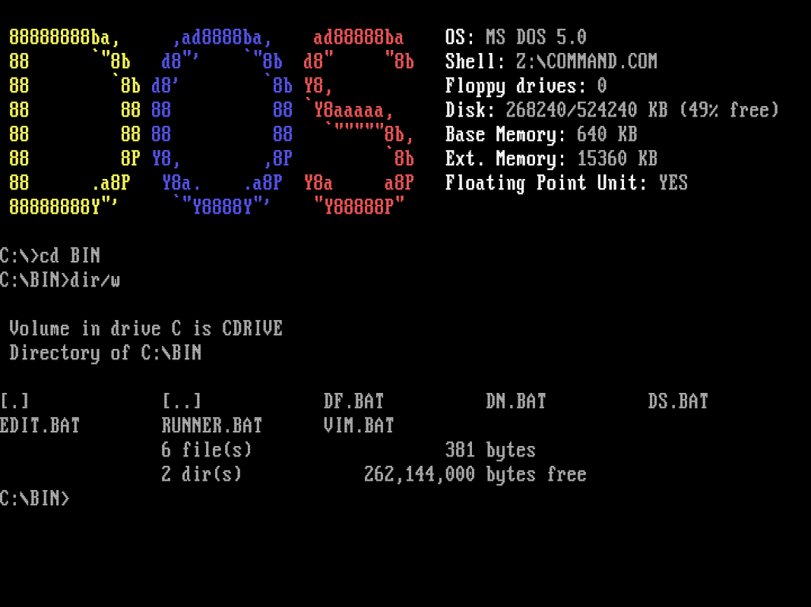
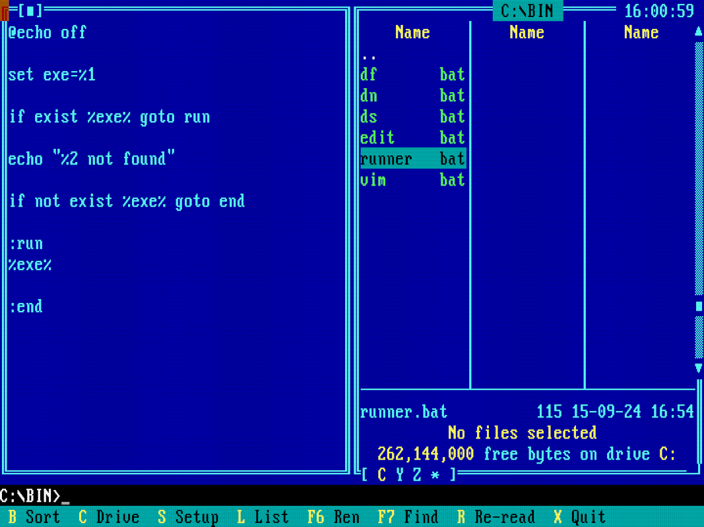

# MY DOS

My tribute for my own early days of computing, creating a x86 experience in **dosbox staging**, for **Debian** based distributions, automated with **Ansible**.





## Install

```
make install
```

- Installs dependencies of **dosbox staging**.
- Downloads **dosbox staging** built version, symlink binary an configuration file.
- Create a symlink between `c` folder and `~/dos/c`, for mounting the c drive.
- Download the following programs in the mounted drive:
  - **Edit** (MS-DOS Editor)
  - **Dos Navigator** (File Manager)
  - **Dos Shell** (Another Manager)
  - **Vim 7** (Text Editor, because it's funny)
  - **[Dosfetch](https://github.com/leahneukirchen/dosfetch)** (System Information)

## Uninstall

```
make uninstall
```

Will clean up the installation.

## Dos Environment

The batch files for running external programs are located in `C:\BIN`, this path is added to the `PATH` environment variable. There is no `AUTOEXEC.BAT` file, its contents are defined in the `dosbox-staging.conf` file.

When **dosbox staging** starts, it will provide drive `Y:\` for dos, `Z:\` for the internal programs. Then the autoexec part of the configuration will mount `~/dos/c` folder as the `C:\` drive, add the `C:\BIN` to the `PATH` and call dosfetch for bling-bling.

## Basic Usage

Start **dosbox staging** with the command `dosbox`. In this setup you're ment to spend your time in `dosbox` instead of using it as only a runtime for games and programs that are started from you system directly.

### Commands

The two most important commands provided by **dosbox** are:

- `help` - Will teach you everything you need to know about **dos** and **dosbox**.
- `intro` - Will show you how **dosbox** emulation works.

You can use the following custom commands:

- `edit` - Will start the Editor.
- `dn` - Will start Dos Navigator.
- `ds` - Will start Dos Shell.
- `vim` - Will start Vim.
- `df` - Will show system information.

### Games

There are no games provided in this repository, but I kept the folder structure I use and some starter batch files for running games called `RUN.BAT`, for automating cd-rom mounting and similar things.
